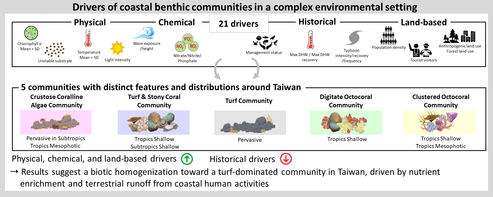

  
&nbsp; &nbsp; &nbsp; &nbsp;

# Data from: Environmental influence on coastal benthic communities in a complex setting

---

This Linetal_submitted_dataset_README.txt file was generated on 2024-04-23 by Yuting Vicky Lin (vicky.linyuting@gmail.com). Knit [Lin_et_al_MPB.Rmd](Lin_et_al_MPB.Rmd) to generate html and extract R code.

1. **Author Information**

	+ First author
		+ Name: Yuting Vicky Lin
		+ Institution: Institute of Oceanography, National Taiwan University, Taipei 10617, Taiwan

	+ Second author
		+ Name: Dr. Pierre-Alexandre Château
		+ Institution: Department of Marine Environment and Engineering, National Sun Yat-Sen University, Kaohsiung 80420, Taiwan 
 		
	+ Third author 
		+ Name: Dr. Yoko Nozawa
		+ Institution: Tropical Biosphere Research Center, University of the Ryukyus, Okinawa 905-0227, Japan 
		
	+ Fourth author 
		+ Name: Dr. Chih-Lin Wei
		+ Institution: Institute of Oceanography, National Taiwan University, Taipei 10617, Taiwan
			
	+ Fifth author 
		+ Name: Dr. Rainer Ferdinand Wunderlich
		+ Institution: Department of Bioenvironmental Systems Engineering, National Taiwan University, Taipei 10617, Taiwan &
                             5INRAE, UR EABX, 33612 Cestas, France

	+ Sixth & corresponding author 
		+ Name: Dr. Vianney Denis
		+ Institution: Institute of Oceanography, National Taiwan University, Taipei 10617, Taiwan
		+ Email: vianneydenis@ntu.edu.tw

2. **Date of data collection**: 2016-2020

3. **Geographic location of data collection**: Taiwan, West Pacific

4. **Funding sources that supported the collection of the data**: Marine National Park of Taiwan, National Science and Technology Council of Taiwan, Ocean Affairs Council of Taiwan 

5. **Recommended citation for this dataset**
Lin YT, Château P-A, Nozawa Y, Wei C-L, Wunderlich RF, Denis V (2023), Data from: Environmental influence on coastal benthic communities in a complex setting, Dryad, Dataset, https://doi.org/????

[Data and R script are also available through the GitHub repository https://github.com/NTU-FRELab/drivers-communities in order to replicate our analyses]

## DESCRIPTION OF THE DATA AND FILE STRUCTURE

### DATA & FILE OVERVIEW

1. **Description of dataset**

    These data were used to identify distinct benthic communities around Taiwan and the important environmental drivers causing the difference.

2. **File List**

   + File 1: Linetal_dataset_Benthic.csv
       + File 1 description: benthic cover estimates of the 433 sampling transects

   + File 2: Linetal_dataset_Env.csv
       + File 2 description: data of 21 environmental drviers in the 433 sampling transects

   + File 3: Linetal_dataset_Cor.csv
       + File 3 description: coordination and benthic information used to generate Figure 1b 

   + File 4: Linetal_dataset_TW.shp
       + File 4 description: file of Taiwan map used to generate Figure 1a

   + File 5: Linetal_dataset_TW.cpg
       + File 5 description: file of Taiwan map used to generate Figure 1a

   + File 6: Linetal_dataset_TW.dbf
       + File 6 description: file of Taiwan map used to generate Figure 1a

   + File 7: Linetal_dataset_TW.prj
       + File 7 description: file of Taiwan map used to generate Figure 1a

   + File 8: Linetal_dataset_TW.shx
       + File 8 description: file of Taiwan map used to generate Figure 1a

### METHODOLOGICAL INFORMATION

A detailed description of data acquisition and processing can be found in the published manuscript in the XXX (https://doi.org/XXX).

#### DATA-SPECIFIC INFORMATION

##### **Linetal_dataset_Benthic.csv**

1. Number of variables/columns: 28

2. Number of cases/rows: 434

3. Missing data codes

    None

4. Variable List

    + Column A - transect
    + Column B - ac_erect_single
    + Column C - ag_articulated_calcareous
    + Column D - ag_corticated_foliose
    + Column E – ag_corticated_macrophyte
    + Column F – cca_crustose
    + Column G – cy_filamentous
    + Column H – hc_arborescent
    + Column I – hc_bushy
    + Column J – hc_column
    + Column K – hc_encrusting
    + Column L – hc_foliose
    + Column M – hc_massive
    + Column N – hc_table
    + Column O – oc_arborescent
    + Column P – oc_bushy
    + Column Q – oc_cluster
    + Column R – oc_digitate
    + Column S – oc_encrusting
    + Column T – oc_lobate
    + Column U – oc_massive
    + Column V – sg
    + Column W – sp_encrusting
    + Column X – sp_massive
    + Column Y – sp_repent
    + Column Z – turf_filamentous
    + Column AA – zo_encrusting
    + Column AB – zo_massive

5. Abbreviations used
  
    + for major benthic categories: 
      + ac: ascidian
      + ag: alga
      + cca: crustose coralline alga
      + cy: cyanobacteria
      + hc: hard coral
      + oc: octocoral
      + sg: sea grass
      + sp: sponge
      + turf:turf alga
      + zo: zoanthid

##### **Linetal_dataset_Env.csv**

1. Number of variables/columns: 26

2. Number of cases/rows: 434

3. Missing data codes

    None

4. Variable List

    + Column A - Region
    + Column B - Site
    + Column C - Depth
    + Column D - Latitude
    + Column E – Longitude
    + Column F – Mean_SST
    + Column G – SD_SST
    + Column H – Light_intensity
    + Column I – Wave_exposure
    + Column J – Wave_height
    + Column K – Mean_chl_a
    + Column L – SD_chl_a
    + Column M – Nitrate
    + Column N – Nitrite
    + Column O – Phosphate
    + Column P – DHW
    + Column Q – DHW_recovery
    + Column R – Typhoon_disturbance
    + Column S – Typhoon_recovery
    + Column T – Typhoon_frequency
    + Column U – Anthropogenic_land_use
    + Column V – Forest_land_use
    + Column W – Population_density
    + Column X – Tourist_visitors
    + Column Y – Unstable_substrate_cover
    + Column Z – Management_status

5. Abbreviations used
  
    + for major benthic categories: 
      + SST: sea surface temperature
      + SD: standard deviation
      + DHW: degree heating week

##### **Linetal_dataset_Cor.csv**

1. Number of variables/columns: 14

2. Number of cases/rows: 88

3. Missing data codes

    None

4. Variable List

    + Column A - Region
    + Column B - Site
    + Column C - Depth
    + Column D - Latitude
    + Column E – Longitude
    + Column F – 1
    + Column G – 2
    + Column H – 3
    + Column I – 4
    + Column J – 5
    + Column K – y
    + Column L – x
    + Column M – Label1
    + Column N – Label2

5. Abbreviations used
  
    + for variables: 
      + 1: CCA Community 
      + 2: Turf & Stony Cooral Community
      + 3: Turf Community
      + 4: Digitate Community
      + 5: Bushy Community
      + y: the vertical position of the pie chart
      + x: the horizental position of the pie chart
      + Label1: the number of sampling locations used in Figure 1a
      + Label2: the number of sampling locations used in Figure 1b